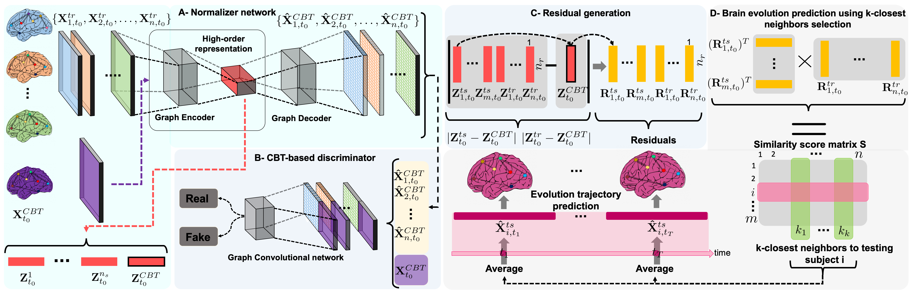
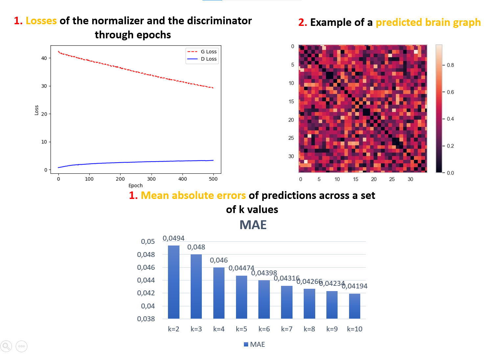

# gGAN-PY (graph-based Generative Adversarial Network for normalizing brain graphs with respect to a fixed template) in Python
gGAN-PY (graph-based Generative Adversarial Network) framework for normalizing brain graphs with respect to a fixed template, coded up in Python
by Zeynep Gürler and Ahmed Nebli. Please contact zeynepgurler1998@gmail.com for inquiries. Thanks.
 
> **Foreseeing Brain Graph Evolution Over Time
Using Deep Adversarial Network Normalizer**
> [Zeynep Gürler](https://github.com/zeynepgurler)1, [Ahmed Nebli](https://github.com/ahmednebli)1,2, [Islem Rekik](https://basira-lab.com/)1
> 1BASIRA Lab, Faculty of Computer and Informatics, Istanbul Technical University, Istanbul, Turkey
> 2National School for Computer Science (ENSI), Mannouba, Tunisia
>
> **Abstract:** *Foreseeing the brain 
evolution as a complex highly interconnected system, widely modeled as a graph, 
is crucial for mapping dynamic interactions between different anatomical regions 
of interest (ROIs) in health and disease. Interestingly, brain graph evolution 
models remain almost absent in the literature. Here we design an adversarial brain 
network normalizer for representing each brain network as a transformation of a 
fixed centered population-driven connectional template. Such graph normalization 
with respect to a fixed reference paves the way for reliably identifying the most 
similar training samples (i.e., brain graphs) to the testing sample at baseline 
timepoint. The testing evolution trajectory will be then spanned by the selected 
training graphs and their corresponding evolution trajectories. We base our prediction
 framework on geometric deep learning which naturally operates on graphs and nicely preserves 
 their topological properties. Specifically, we propose the first graph-based 
 Generative Adversarial Network (gGAN) that not only learns how to normalize brain 
 graphs with respect to a fixed connectional brain template (CBT) (i.e., a brain 
 template that selectively captures the most common features across a brain population)
  but also learns a highorder representation of the brain graphs also called embeddings. We use these embeddings to compute the similarity between training and testing 
  subjects which allows us to pick the closest training subjects at baseline timepoint to predict the evolution of the testing brain graph over time. A series of benchmarks against several comparison methods showed that our proposed method achieved the 
lowest brain disease evolution prediction error using a single baseline timepoint.

 
# Detailed proposed framework pipeline
This work has been published in the Journal of workshop PRIME at MICCAI, 2020. Our framework is a brain graph evolution trajectory prediction framework based on a gGAN architecture comprising a normalizer network with respect to a fixed connectional brain template (CBT). Our learning-based framework comprises four key steps. (1) Learning to normalize brain graphs with respect to the CBT, (2) Embedding the training, testing graphs and the CBT, (3) Brain graph evolution prediction using top k-closest neighbor selection. Experimental results against comparison methods demonstrate that our framework can achieve the best results in terms of average mean absolute error (MAE). We evaluated our proposed framework from OASIS-2 preprocessed dataset (https://www.oasis-brains.org/). 

More details can be found at: (link to the paper) and our research paper video on the BASIRA Lab YouTube channel (link). 

# Libraries to preinstall in Python
* [Python 3.8](https://www.python.org/)
* [PyTorch 1.4.0](http://pytorch.org/)
* [Torch-geometric](https://github.com/rusty1s/pytorch_geometric)
* [Torch-sparse](https://github.com/rusty1s/pytorch_sparse)
* [Torch-scatter](https://github.com/rusty1s/pytorch_scatter)
* [Scikit-learn 0.23.0+](https://scikit-learn.org/stable/)
* [Matplotlib 3.1.3+](https://matplotlib.org/)
* [Numpy 1.18.1+](https://numpy.org/)

# Demo

gGAN is coded in Python 3.8 on Windows 10. GPU is not needed to run the code.
This code has been slightly modified to be compatible across all PyTorch versions.
In this repo, we release the gGAN source code trained and tested on a simulated data as shown below:

**Data preparation**

We simulated random graph dataset drawn from two Gaussian distributions using the function np.random.normal. 
Number of subjects, number of regions, number of epochs and number of folds are manually 
inputted by the user when starting the demo.

To train and evaluate gGAN code on other datasets, you need to provide:

• A tensor of size (n × m × m) stacking the symmetric matrices of the training subjects.
 n denotes the total number of subjects and m denotes the number of regions. 

The demo outputs are:

• A matrix of size (t × l × (m × m)) stacking the predicted features of the testing subjects.
t denotes the total number of testing subjects, l denotes the number of varying k numbers.

**Train and test gGAN**

To evaluate our framework, we used leave-one-out cross validation strategy.

To try our code, you can use: demo.py
For how to install and run our framework, go to LINKK

# Python Code
To run gGAN, generate a fixed connectional brain template. Use netNorm: https://github.com/basiralab/netNorm-PY

# Example Results
If you set the number of epochs as 500, number of subjects as 90 and number of regions as 35, you will approximately get the following outputs when running the demo with default parameter setting:

# YouTube videos to install and run the code and understand how gGAN works

To install and run our prediction framework, check the following YouTube video:
https://youtu.be/2zKle7GzrIM

To learn about how our architecture works, check the following YouTube video:
https://youtu.be/5vpQIFzf2Go

# Related References
Fast Representation Learning with Pytorch-geometric: Fey, Matthias, Lenssen, Jan E., 2019, ICLR Workshop on  Representation Learning on Graphs and Manifolds

Network Normalization for Integrating Multi-view Networks (netNorm): Dhifallah, S., Rekik, I., 2020, Estimation of connectional brain templates using selective multi-view network normalization

# Please Cite the Following paper when using gGAN:

@article{gurler2020, title={ Foreseeing Brain Graph Evolution Over Time
Using Deep Adversarial Network Normalizer},  
author={Gurler Zeynep, Nebli Ahmed, Rekik Islem},  
journal={Predictive Intelligence in Medicine International Society and Conference Series on Medical Image Computing and Computer-Assisted Intervention},
volume={},  
pages={},  
year={2020},  
publisher={Springer}  
} 

